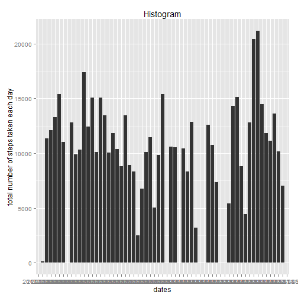

# Reproducible Research: Peer Assessment 1

## Loading and preprocessing the data

### Let us start!:)


```r
Sys.setenv(LANG = "en")
rm(list = ls())
setwd("~/R kursy/R kurs 5/pa 1/RepData_PeerAssessment1")
Sys.setlocale(category = "LC_ALL", locale = "C")
```

```
## [1] "C"
```

```r
fileUrl <- "activity.csv"
ramka <- read.csv(file = fileUrl) #ramka is our data frame
```

## What is mean total number of steps taken per day?

### A histogram of the total number of steps taken each day:


```r
x <- split(ramka$steps, ramka$date)
steps_per_day <- unlist(lapply(x, sum, na.rm = TRUE), recursive = TRUE, use.names = FALSE)
dates_seq<- seq(as.Date("2012-10-01"), length.out=61, by="+1 day")
dates_labels <- as.character(dates_seq)
ramka_do_hist <- data.frame(steps = steps_per_day, dates = dates_seq)
dates_factor <-factor(dates_seq)
library(ggplot2)
ggplot(aes(x = dates_factor, y = steps_per_day), data=ramka_do_hist) + geom_bar(stat = "identity", width = .8) + 
 xlab("dates") + ylab("total number of steps taken each day") + labs(list(title = "Histogram"))
```

 

### We calcultate mean and median of total number of steps taken per day


```r
mean(steps_per_day, na.rm = TRUE)
```

```
## [1] 9354.23
```

```r
median(steps_per_day, na.rm = TRUE)
```

```
## [1] 10395
```

## What is the average daily activity pattern?

### We make a time series plot of the 5-minute interval (x-axis) and the average number of steps taken, averaged across all days (y-axis)


```r
x <- split(ramka$steps, ramka$interval)
steps_per_interval <- unlist(lapply(x, mean, na.rm = TRUE), recursive = TRUE, use.names = FALSE)
ramka_do_steps_per_interval <- data.frame(steps = steps_per_interval, interval = unique(ramka$interval))
qplot(interval, steps, data= ramka_do_steps_per_interval, geom="line") + ylab("average number of steps")
```

 

### We calcultate which 5-minute interval, on average across all the days in the dataset, contains the maximum number of steps?


```r
minutes <- unique(ramka$interval)
minutes[which(steps_per_interval == max(steps_per_interval))]
```

```
## [1] 835
```

## Imputing missing values

### We calculate the total number of missing values in the dataset (i.e. the total number of rows with NAs)


```r
sum(is.na(ramka$steps))
```

```
## [1] 2304
```

### We replace NA values with mean for that 5-minute interval corresponding to that missing value. We have new column ### We create a new column **steps2**.


```r
for (i in (1:nrow(ramka)))
{
if (is.na(ramka$steps[i]))
{
ramka$steps2[i] = steps_per_interval[which(minutes == ramka$interval[i])]
}
else
{
ramka$steps2[i] = ramka$steps[i]
}

}
```

### We create a new dataset that is equal to the original dataset but with the missing data filled in.


```r
ramka_last = ramka[,c(4,2,3)]
```

### We calculate mean and median of total number of steps taken per day with our new data.


```r
x <- split(ramka$steps2, ramka$date)
steps2_per_day <- unlist(lapply(x, sum, na.rm = TRUE), recursive = TRUE, use.names = FALSE)
mean(steps2_per_day, na.rm = TRUE)
```

```
## [1] 10766.19
```

```r
median(steps2_per_day, na.rm = TRUE)
```

```
## [1] 10766.19
```

### Do these values differ from the estimates from the first part of the assignment?

Yes. Mean and median have increased. Now they are equal.  

### What is the impact of imputing missing data on the estimates of the total daily number of steps?

Total daily number of steps increased in periods when missing data occured. 

### Make a histogram of the total number of steps taken each day with our new data


```r
dates_seq<- seq(as.Date("2012-10-01"), length.out=61, by="+1 day")
dates_labels <- as.character(dates_seq)
ramka_do_hist <- data.frame(steps = steps2_per_day, dates = dates_seq)
dates_factor <-factor(dates_seq)
library(ggplot2)
ggplot(aes(x = dates_factor, y = steps2_per_day), data=ramka_do_hist) + geom_bar(stat = "identity", width = .8) + xlab("dates") + ylab("total number of steps taken each day") + labs(list(title = "New histogram"))
```

 

## Are there differences in activity patterns between weekdays and weekends?

### We create a new factor variable in the dataset with two levels -- "weekday" and "weekend" indicating whether a given date is a weekday or weekend day.


```r
library(plyr)
ramka_last$day = weekdays(as.Date(ramka_last$date))
ramka_last$day <- mapvalues(ramka_last$day, from = c("Monday", "Tuesday", "Wednesday", "Thursday", "Friday", "Saturday", "Sunday"), to = c("weekday", "weekday", "weekday", "weekday", "weekday", "weekend", "weekend"))
```

### We make a panel plot containing a time series plot of the 5-minute interval (x-axis) and the average number of steps taken, averaged across all weekday days or weekend days (y-axis). 


```r
x <- split(ramka_last$steps2, list(ramka_last$interval, ramka_last$day))
steps2_per_interval <- unlist(lapply(x, mean, na.rm = TRUE), recursive = TRUE, use.names = FALSE)
ramka_weekend <- data.frame(steps2 = steps2_per_interval, interval = rep(unique(ramka_last$interval),2))
ramka_weekend$day <- factor(c(rep("weekday", 288), rep("weekend", 288) ))
library(lattice)
xyplot(steps2 ~ interval | day, data = ramka_weekend, horizontal = TRUE, col.line = "darkorange", type = c("l"), 
layout=c(1,2))
```

 

### We observe more sleep and active exercices in weekends, more sitting in front of the computer in weekdays!:)
